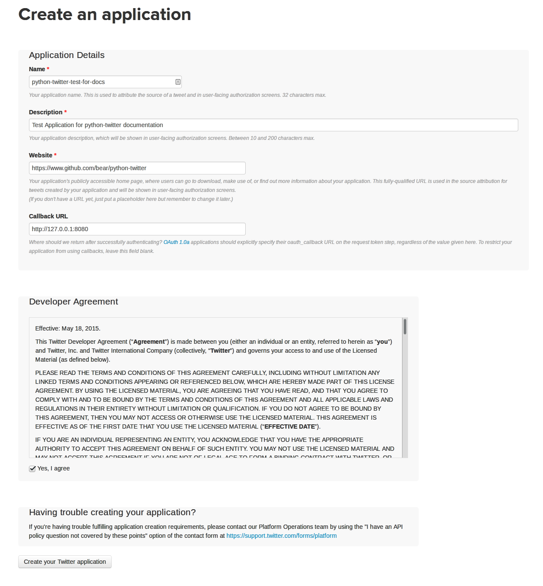
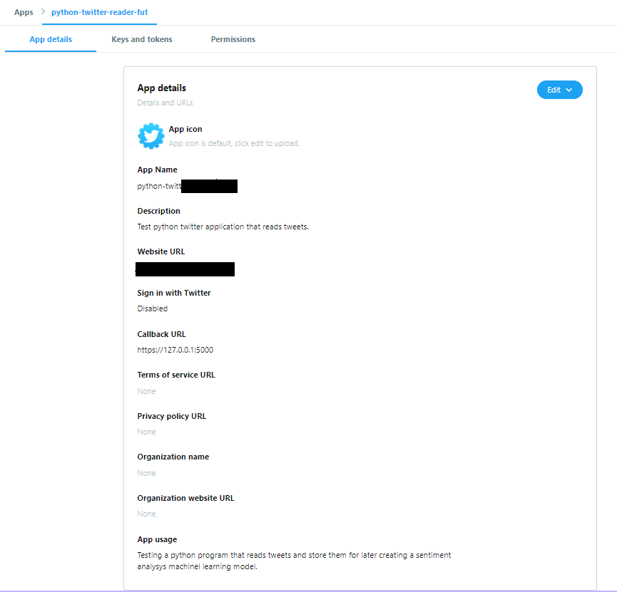
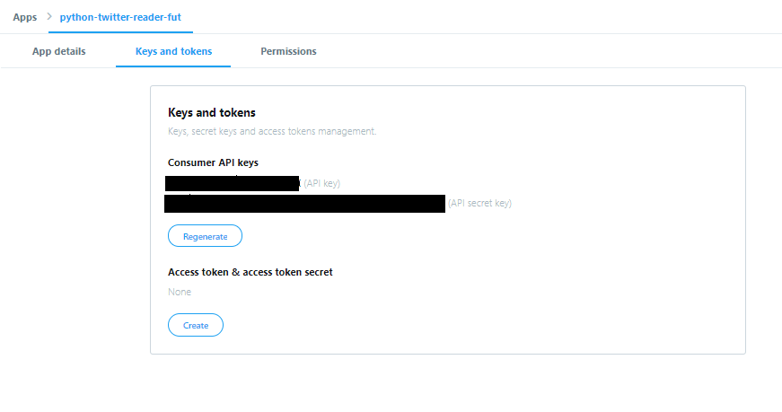
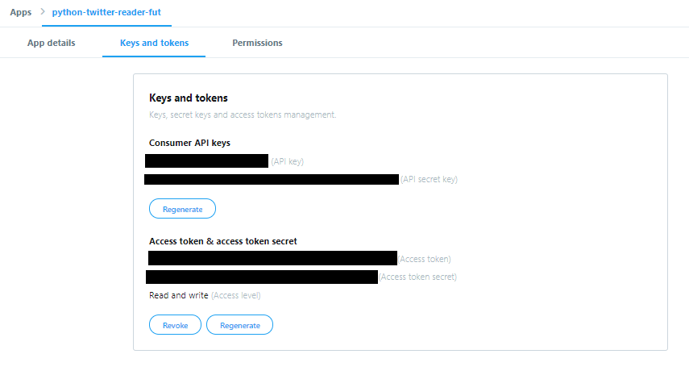

Getting Started
===============

Getting your application tokens
-------------------------------

This section is subject to changes made by Twitter and may not always be completely up-to-date. If you see something change on their end, please create a [new issue on Github](https://github.com/saeedesmaili/better-twitter/issues/new) or submit a pull request to update it.

In order to use the better-twitter, you first need to acquire a set of application tokens. These will be your `consumer_key` and `consumer_secret`, which get assed to better-twitter when starting your application.

### Create your app

The first step in doing so is to create a [Twitter App](https://apps.twitter.com/). Click the "Create New App" button and fill out the fields on the next page.

If there are any problems with the information on that page, Twitter will complain and you can fix it. (Make sure to get the name correct - it is unclear if you can change this later.) On the next screen, you'll see the application that you created and some information about it:

### Your app

Once your app is created, you'll be directed to a new page showing you some information about it.

### Your Keys

Click on the "Keys and Access Tokens" tab on the top.

Under the "Access token & access token secret" option, click on the "create" button to generate a new access token and token secret.

If you are creating an application for end users/consumers, then you will want them to authorize your application, but that is outside the scope of this document.

And that should be it!